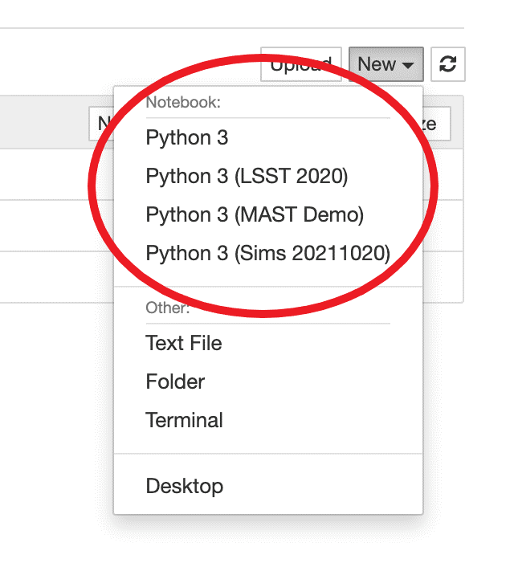

Customizing your Hub
---------------------

Adding software: Conda Environments
~~~~~~~~~~~~~~~~~~~~~~~~~~~~~~~~~~~
You can create any number of personal conda environments.

.. code-block:: console

    $conda create -n solarsystem openorb
    $conda activate solarsystem
    $oorb

If the ``ipykernel`` package is installed in the environment, it will automatically show up in your list of kernels.

- To install ``ipykernel`` use this command,

.. code-block:: console

    $mamba install ipykernel

.. IMPORTANT:: These environments are only accessible to you (they’re personal).
