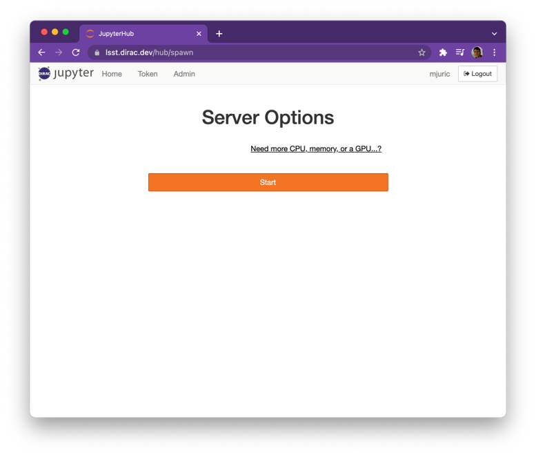
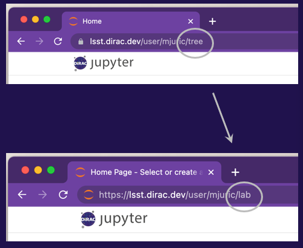
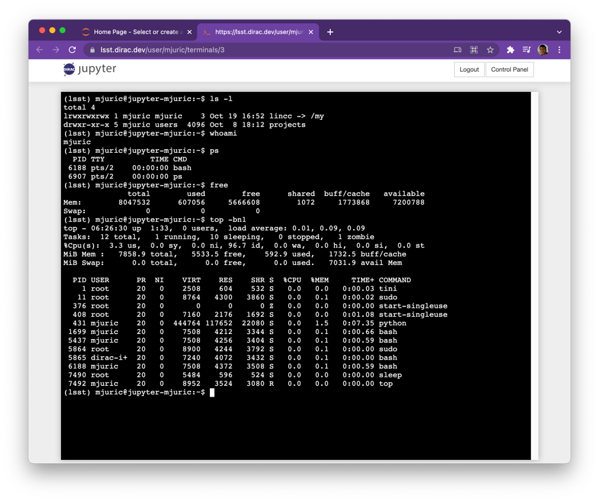
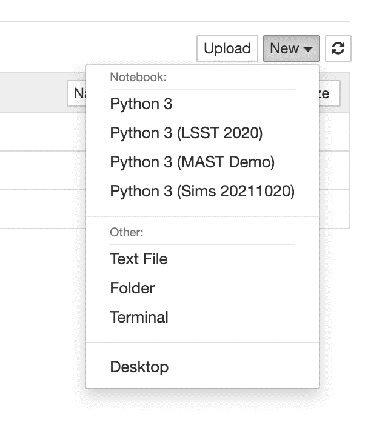

Introduction to Jupyter
=========================
*Your “Home in the Clouds”*

• When you logged in and clicked “Start” (big orange button), Jupyter asked Amazon Web Services to allocate a dedicated machine* for your use.

• While this machine is just yours to use, it has access to the shared directory with software and files. This is not unlike how office computers in many institutions see the same filesystem.
• This machine can only be accessed through Jupyter (Notebook, Lab, Terminal). Note: direct SSH access is in the works.

.. IMPORTANT:: If you don’t use it for more than an hour (close the browser with Jupyter), it will be shut down to conserve resources. Disk data will be preserved, but all running Jupyter notebooks will be shut down.

Jupyter Notebooks
--------------------------------

You can access a notebook from the Jupyter homepage by clicking the "New" button and selecting a virtual environment for your notebook.

.. image:: images/Picture5edit.png
    :width: 250
    :align: center

.. image: images/Picture8.png
    :width: 400
    :align: left

Accessing JupyterLab
~~~~~~~~~~~~~~~~~~~~
If you prefer the JupyterLab interface, replace the ‘tree’ in your URL with ‘lab’.

Terminal
--------
To access the Terminal, click the "New" button and select the "Terminal" option. This will open a new terminal instance for your server.

.. image:: images/Picture6.png
    :width: 200
    :align: left

You can use this to manage your directories, edit files, install and run codes, etc.

Available Software
--------------------------------

* Python 3: Python 3 with the current LSST Stack Release.
* Python 3 (Sims NNNNNN): Python 3 with a recent install of the rubin_sims tools (https://github.com/lsst/rubin_sim)
* Python 3 (xxx):  Older LSST Stack releases and custom environments prepared for events.

